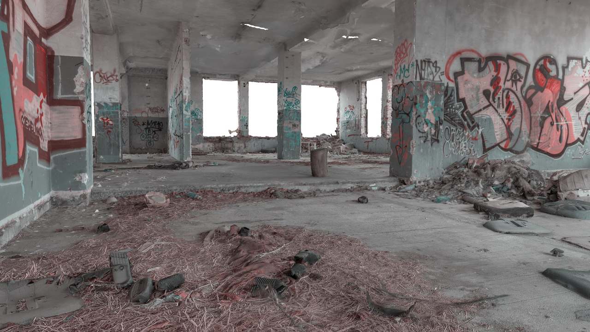
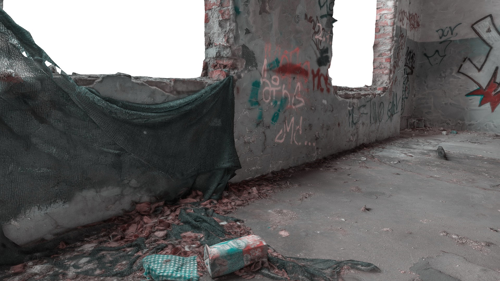
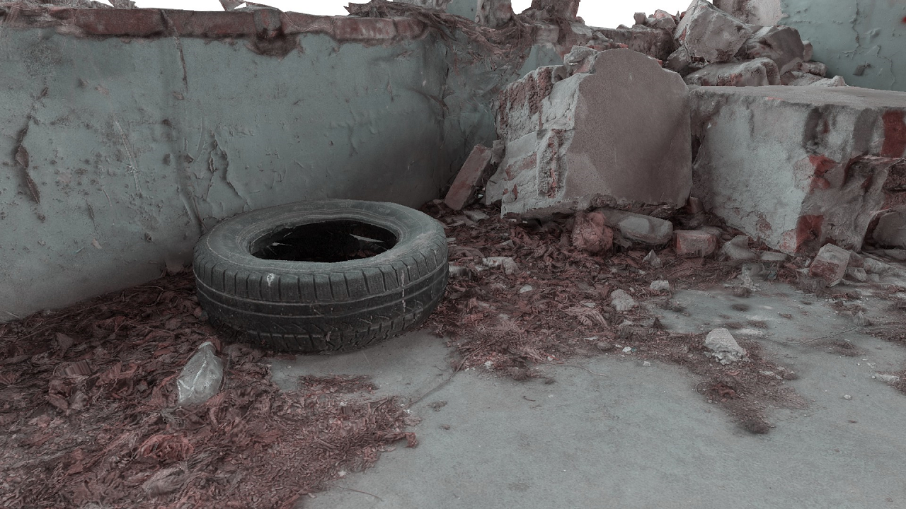

# VoxelEngine

A real-time software graphics engine based on the Sparse Voxel Octree (SVO) data structure and a proprietary rendering algorithm. The engine is capable of rendering detailed large and unique scenes in real time using only the CPU. Frame rendering time is independent of the level of detail and size of scene. Synthesized images are aliasing-free, thanks in part to approximate analytical edge filtering.

The project consists of a main demo program named `Renderer` (which contains the renderer) and two converters: `MeshConverter` and `PointCloudConverter`, responsible for converting the scene into an internal format. The entire project is written from scratch in C/C++. OpenGL is exclusively used for displaying already rendered images.

The project was created as my undergraduate diploma thesis back in 2012.

### Usage

Build a solution using Visual Studio (all necessary files are attached). Convert a point cloud or a high-poly mesh (in OBJ format) using converters located in the `bin` directory. Run the `Renderer` program, which you can control with the mouse and WSAD keys. You can configure the programs' operation using configuration files.

